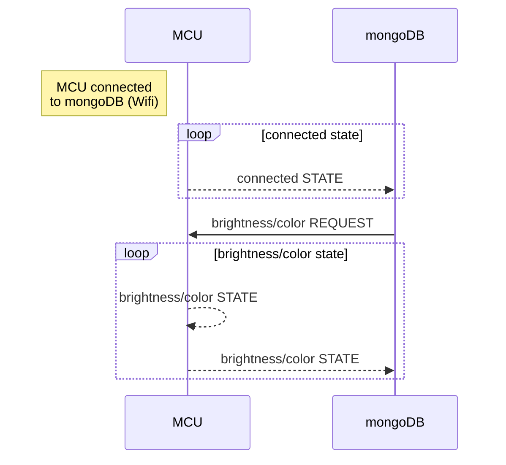

```mermaid
sequenceDiagram
    Note left of MCU: MCU connected <br>to mongoDB (Wifi)
    participant MCU
    participant mongoDB
    loop connected state
        MCU -->>mongoDB: connected STATE 
    end
    mongoDB->>MCU: brightness/color REQUEST
    loop brightness/color state
        MCU -->>MCU: brightness/color STATE
        MCU -->>mongoDB: brightness/color STATE
    end
```