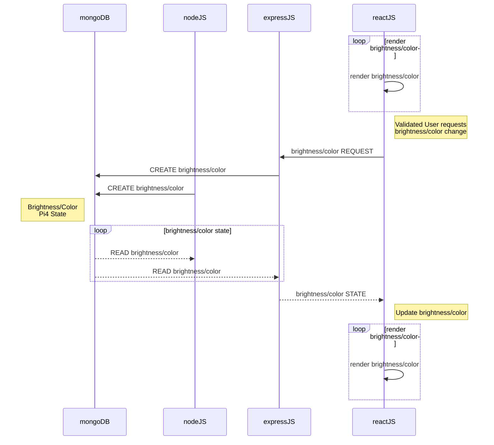

```mermaid
sequenceDiagram
    participant mongoDB
    participant nodeJS
    participant expressJS
    participant reactJS
    loop render brightness/color
        reactJS->>reactJS: render brightness/color
    end
    Note right of reactJS: Validated User requests <br>brightness/color change
    reactJS->>expressJS: brightness/color REQUEST
    expressJS->>mongoDB: CREATE brightness/color
    nodeJS->>mongoDB: CREATE brightness/color
    Note left of mongoDB: Brightness/Color <br> Pi4 State
    loop brightness/color state
        mongoDB-->>nodeJS: READ brightness/color
        mongoDB-->>expressJS: READ brightness/color
    end
    expressJS-->>reactJS: brightness/color STATE
    Note right of reactJS: Update brightness/color
    loop render brightness/color
        reactJS->>reactJS: render brightness/color
    end
```