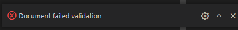

# Database  Structure

There are two collections created: One for accounts and one for devices.
<br>

Within **accounts** there are the following fields:
<dt><b>_id : ObjectID</b></dt>
    <dd>A unique object identifier added to have a primary key for accounts.</dd>
<br>
<dt><b>username : String</b></dt>
    <dd>A username for the account credentials. Used for login and user representation purposes.</dd>
<br>
<dt><b>password : String</b></dt>
    <dd>A password for the account credentials. Needed for login authentication purposes.</dd>
<br>
<dt><b>devices : Array</b></dt>
    <dd>An array of devices registered to an account. Stores unique device objectIds to reference from the mongoDB collection of devices.</dd>
<br>
* id, username, password, and devices are required fields.  The <i>devices</i> array may be empty.

<br>
<hr>
<br>

Within **devices** there are the following fields:
<dt><b>_id : ObjectID</b></dt>
    <dd>A unique object identifier added to have a primary key for devices.</dd>
<br>
<dt><b>powered : Bool</b></dt>
    <dd>A true/false status for determining whether or not a device has power and is ready for use with the site.</dd>
<br>
<dt><b>connected : Bool</b></dt>
    <dd>A true/false status for determining whether or not a device is connected and ready for use with the site.</dd>
<br>
<dt><b>color : String</b></dt>
    <dd>A hexadecimal representation of color for the device to display.</dd>
<br>
<dt><b>brightness : Integer</b></dt>
    <dd>An integer used to determine the strength of the light emitted from the device. Ranges from 0 to 100.</dd>
<br>
* All of the fields are required.
<br>
<br>
<br>

# Database Validation

Because it is desired for the database to only accept specific information, it is important to validate the data being handled. This will reduce the potential for errors to occur due to incorrect formatting and other potentially unexpected ways.

To validate the schema structure above, the Accounts and Devices collections were made with validation rules. Below is an example of how the Accounts validates data.

```js
db.createCollection("Accounts", {
   validator: {
      $jsonSchema: {
         bsonType: "object",
         title: "Accounts",
         required: [ "_id", "username", "password", "devices" ],
         properties: {
            _id: {
               bsonType: "objectId",
            },
            username: {
               bsonType: "string",
            },
            password: {
               bsonType: "string",
            },
            devices: {
               bsonType: [ "array" ],
               uniqueItems: true,
               items:{
                  bsonType: "objectId",
                  additionalProperties: false
               }
            }
         }
      }
   }
} )
```

The validator will require data to have an objectId _id, a string username, a string password, and an array of devices where there are no duplicates and the items in the array are objectIds. Do note, the devices array is required but items in the array are not.

With the validator in place, queries can be used to test validation. For example, the following querey would pass and be inserted into the database.

```js
db.Accounts.insertOne( {
   _id: ObjectId('6360f5b9c2da459035c3ad31'),
   username: "X34kz",
   password: "deerlord",
   devices:[ObjectId('6360f5b9c2da454f35c3ad31'), ObjectId('636345b9c2da454f35c3ad31')]
} )
```
Output: 
```json
{
  "acknowledged": true,
  "insertedId": {
    "$oid": "6360f5b9c2da459035c3ad31"
  }
}
```
The result shows the querey passed validation and was successfully inserted into the database. Additionally, a query can be used to view/verify the newly created document was successfully inserted into the database.

Query:
```js
db.Accounts.find({_id: ObjectId("6360f5b9c2da459035c3ad31")})
```
Result:
```json
[
  {
    "_id": {
      "$oid": "6360f5b9c2da459035c3ad31"
    },
    "username": "X34kz",
    "password": "deerlord",
    "devices": [
      {
        "$oid": "6360f5b9c2da454f35c3ad31"
      },
      {
        "$oid": "636345b9c2da454f35c3ad31"
      }
    ]
  }
]
```
<br>
<hr>
<br>

On the other hand, if an invalid query is made, such as the one below:
```js
db.Accounts.insertOne( {
   _id: ObjectId('6360f5b9c2da779035c3ad31'),
   username: "1222",
   password: "deerlord",
   devices:[ObjectId('6360f5b9c2d9994f35c3ad31'), ObjectId('6360f5b9c2d9994f35c3ad31')]
} )
```
Invalid because of duplicate items in the array: A error will occur and the query will not do anything.



<br>
<br>
<br>
<hr>
The full MongoDB playground file is in this repo for viewing additional test cases and the set up for validation of the Devices collection. 